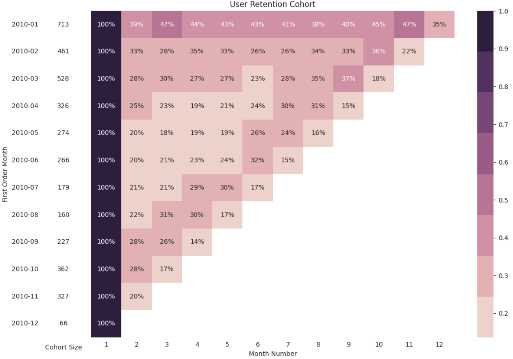

# User Retention Analysis Using Cohort Analysis

## Project Overview

This project aims to analyze customer retention patterns using Cohort Analysis. By grouping customers based on their first purchase month, the analysis helps identify how well customers are retained over time and provides insights into customer loyalty.

## Objectives

- Analyze customer retention across different cohorts.
- Measure retention rates over time.
- Identify cohorts with the highest and lowest retention.
- Generate insights that can support customer retention strategies.

## Dataset

The dataset used in this project contains online retail transaction records, including customer information, invoice dates, product details, and transaction quantities.

## Tools Used

- Python
- Pandas
- NumPy
- Matplotlib
- Seaborn
- Google Colab

## Methodology

1. Data Cleaning
2. Customer Cohort Creation
3. Retention Rate Calculation
4. Cohort Analysis
5. Data Visualization
6. Business Insight Generation

## Key Findings

- The January 2010 cohort had the highest number of first-time customers, with a total of 713 users.
- This cohort also recorded the highest second-month retention rate, with approximately 39% of customers returning to make another purchase.
- Customers who made their first purchase in January 2010 showed stronger loyalty compared to other cohorts, maintaining relatively higher retention rates in the following months.
- Most cohorts had retention rates below 50%, indicating that a large proportion of customers did not return for subsequent purchases.
- The December 2010 cohort showed the lowest retention performance among all cohorts.

## Visualization

## Business Recommendations

- Improve customer onboarding and early engagement strategies.
- Develop loyalty programs to encourage repeat purchases.
- Implement targeted campaigns for inactive customers.
- Monitor retention performance regularly to identify potential customer churn.

## Author

Yona Arya Herwita
